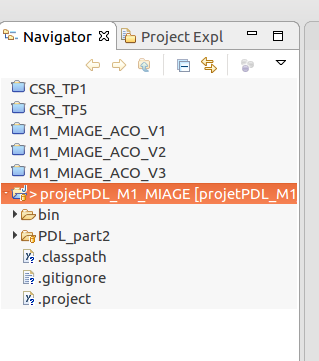
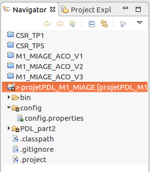

# projetPDL_M1_MIAGE
Projet réalisé dans le cadre du module de PDL du master 1 MIAGE de l'université de Rennes 1. 
Par Vivien Busson, Oliver La Rivière, Clément Le Huërou, Vincent Pelletier, Lucas Lelièvre

Ce projet s'associe à une base MongoDB (voir ci dessous pour l'établissement de la connexion) et à l'API d'Open Food Facts. 
Au cours de l'utilisation, un fichier .csv pourra être généré sur demande de l'utilisateur permettant d'exporter ses données afin de les utiliser sous OpenCompare.org .

<b>I/ Connexion à la base MongoDB : </b>

- Après avoir récupéré les sources du projet depuis GitHub, ouvrez les dans un IDE tel que Eclipse. 
- Vous devez une arborescence similaire à celle ci : 

  

- Ouvrez le fichier "PDL_part2/config/config.properties". Remplacez les champs de type "your****" par les informations de votre base afin d'établir la connexion.

- Une fois les informations saisies, sauvegardez le fichier. 
- Si vous avez bien l'arborescence indiqué au dessus, alors il vous reste une action à réaliser : replacer le répertoire "config" utilisé précédemment à la racine du projet.
- Vous devez une arborescence similaire à celle ci : 

  

<b>II/ Intégration des librairies : </b>

- Le projet nécéssite l'intégration de deux libraires, les .jars de celles ci sont disponibles à la racine du projet, il vous suffit de les ajouter : 
- Clic droit sur nom du projet
- Build path
- Configure build path
- Onglet "librairies"
- Add Jars
- Sélectionner "java-json.jar" et "mongo-java-driver-3.5.0.jar" puis OK
- Apply
- Apply and Close

<b>III/ Lancer le projet : </b>

- À partir d'un IDE : lancer la classe Main.java depuis "PDL_part2/src"
- À partir du .jar : lancer l'éxécutable "application.jar"

<b>IV/ Utilisation : </b>

Le but de l'application est de générer une liste de produits que l'on pourra ensuite comparer à partir d'OpenCompare.org .
Pour cela, il faut rechercher un mot dans le champ de texte qui vous est proposé, par exemple "milk" (attention: la recherche s'effectue en anglais, si vous cherchez un mot d'une autre longue, il est fort probable que vous recherche n'aboutisse pas).
Après validation du mot à rechercher, une liste de catégories associée vous est alors proposé, sélectionnez celle qui correspond le mieux au type de produits que vous souhaitez comparer. Par exemple "Baby milk".
Cette sélection vous retourne alors la liste des produits correspondant à votre recherche. Si les produits sont bien ceux souhaités, vous pouvez cliquer sur "générer csv", cela vous générera le fichier .csv associé. 
Vous pourrez ensuite le glisser dans OpenCompare.org et l'utiliser (voir doc OpenCompare)

